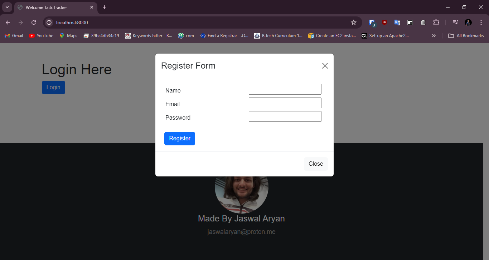

# Task Tracker

Welcome to Task Tracker! Our application is designed to help you efficiently manage and track your tasks. With Task Tracker, you can create, update, and organize your tasks with ease. Assign tasks to team members, monitor due dates, and track progress to boost productivity. Enhance your workflow and stay on top of your responsibilities with Task Tracker.

## Features

- Create and manage tasks
- Assign tasks to team members
- Monitor due dates
- Track progress
- Enhance productivity

## Screenshots

Here are some screenshots of Task Tracker in action:





## Getting Started

To get started with Task Tracker, follow these steps:

1. Clone the repository:
    ```bash
    git clone https://github.com/ombharamadev/tasktracker
    ```
2. Navigate to the project directory:
    ```bash
    cd task-tracker
    ```
3. Create a virtual environment:
    ```bash
    python -m venv venv
    ```
4. Activate the virtual environment:
    - On Windows:
        ```bash
        venv\Scripts\activate
        ```
    - On macOS/Linux:
        ```bash
        source venv/bin/activate
        ```
5. Install dependencies:
    ```bash
    pip install -r req.txt
    ```
6. Apply migrations:
    ```bash
    python manage.py migrate
    ```
7. Start the development server:
    ```bash
    python manage.py runserver
    ```

## Contributing

We welcome contributions from the community! To contribute, please fork the repository and create a pull request with your changes. Ensure your code follows our coding standards and includes appropriate tests.


## Contact

For any questions or feedback, please reach out to us at jaswalaryan@proton.me

---

Thank you for using Task Tracker! Stay organized and productive!
